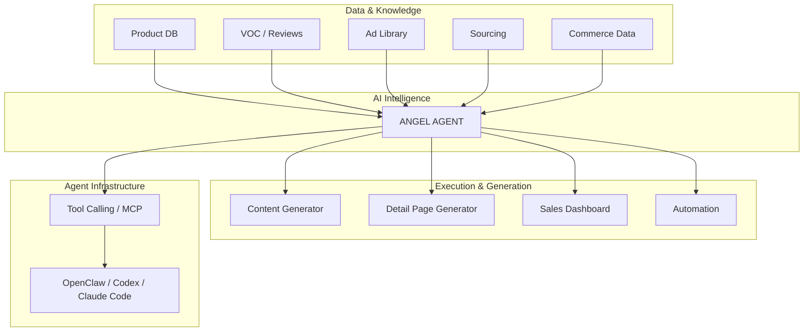

# ANGEL AGENT

## Features

### Product Management
- Product Knowledge Base
- Product CRUD
- USP / Target Customer / Customer Problem Management
- Product Cost / Price / Margin Management
- Product Asset Management

### VOC Intelligence
- CSV / XLSX Review Import
- Review Database
- AI VOC Analysis
- Pain Point Extraction
- Desire & Purchase Motivation Analysis
- Customer Language Extraction
- Product Improvement Insights
- FAQ Generation

### Advertising Intelligence
- Ad Reference Library
- Competitor Ad Management
- Hook / Problem / Desire / Proof / CTA Analysis
- Ad Structure Analysis
- Product-to-Ad Reference Mapping

### AI Content Generation
- Ad Hook Generation
- Ad Copy Generation
- Short-form Video Scripts
- Marketing Video Scripts
- Threads Content
- Instagram Content
- Blog Content
- Copy Variations

### AI Detail Page
- Detail Page Structure Generation
- Sales Copy Generation
- Section-based Page Planning
- Image Prompt Generation
- Brand Tone Application
- React Template Rendering
- Detail Page Preview
- AI-assisted Editing

### Product Sourcing
- Sourcing Candidate Database
- Supplier Management
- Cost / MOQ / Margin Analysis
- Competitor Product Analysis
- Market Opportunity Analysis
- AI Product Evaluation

### Commerce Intelligence
- Sales Dashboard
- Order Analytics
- Advertising Performance
- ROAS / CPA Analysis
- Product Profitability
- Inventory Management
- Margin Analysis
- KPI Monitoring

### Automation
- Scheduled Data Collection
- Webhook Processing
- Sales Data Sync
- Advertising Data Sync
- Inventory Sync
- Review Sync
- Anomaly Detection
- Inventory Alerts
- Automated Reports

### AI Agent
- Product Retrieval
- VOC Analysis
- Ad Search & Analysis
- Content Generation
- Script Generation
- Detail Page Generation
- Sales Analysis
- Inventory Analysis
- Tool Calling
- Multi-step Workflow Execution

### Social & Generative AI
- Threads Content Collection
- Viral Content Analysis
- Automated Social Publishing
- AI Image Generation
- AI Video Generation
- Image / Video Prompt Generation

---

## Architecture

    

## Tech Stack

### Application
- Next.js 16
- React
- TypeScript
- Tailwind CSS

### Backend & Database
- Next.js Server Components
- Server Actions / Route Handlers
- Supabase
- PostgreSQL
- Supabase Auth
- Supabase Storage

### AI
- OpenAI API
- Anthropic Claude API
- Google Gemini API
- Structured Output
- Tool Calling

### Commerce & Marketing Integrations
- Cafe24 API
- Naver Commerce API
- Coupang API
- Meta Marketing API
- Google Ads API
- Threads API

### Automation
- Cron Jobs
- Webhooks
- Background Workflows

### Generative Media
- Gemini Image
- Kling
- Veo
- Seedance

### Agent Infrastructure
- MCP
- OpenClaw
- Codex
- Claude Code

### Infrastructure
- Vercel
- Git
- GitHub

