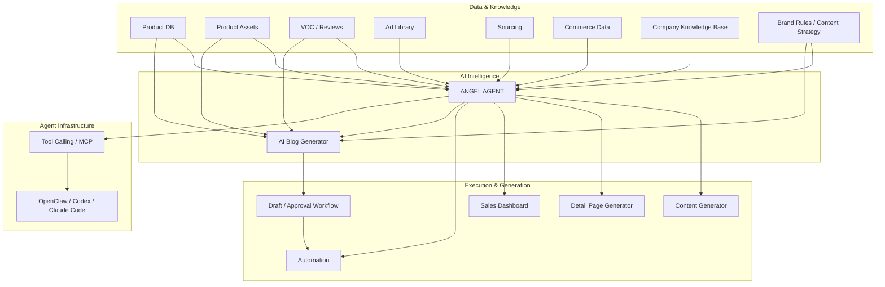

# ANGEL AGENT

Internal E-commerce AI Operating System for product management, VOC intelligence, advertising, content generation, commerce analytics, automation, and AI agent workflows.

## Features

### Product & Commerce

- Product Knowledge Base
- Product CRUD
- Product Asset Management
- USP / Target Customer / Customer Problem Management
- Product Notes
- Cost / Price / Margin Management
- Sales / Order / Inventory Analytics
- ROAS / CPA / CVR Tracking

### AI Blog Content Generator

- Product-based Blog Task Creation
- Keyword / Topic / Purpose Input
- Product Knowledge Retrieval
- Structured Blog Draft Generation
- Title / Introduction / Section / Closing Generation
- Image Placement Suggestions
- Draft Storage
- Draft Editing
- Human Review
- Approval Status Management
- Product Asset Integration
- VOC Integration
- Brand Rule Application
- Naver Blog Publishing Workflow
- Scheduled Publishing
- Published URL / Result Tracking

### VOC & Market Intelligence

- CSV / XLSX Review Import
- Review Database
- AI VOC Analysis
- Pain Point Extraction
- Desire & Purchase Motivation Analysis
- Customer Language Extraction
- Objection Analysis
- Product Improvement Insights
- FAQ Generation
- Competitor Product / Ad Monitoring
- Market Opportunity Analysis
- Supplier / Sourcing Intelligence

### Advertising Intelligence

- Ad Reference Library
- Competitor Ad Management
- Product-to-Ad Reference Mapping
- Hook / Problem / Desire / Proof / CTA Analysis
- Ad Structure Analysis
- Creative Tone Analysis
- Viral Ad Structure Extraction

### AI Content Generation

- Ad Hook Generation
- Ad Copy Generation
- Copy Variations
- Short-form Video Scripts
- 15 / 30 / 60 Second Scripts
- Marketing Video Scripts
- Threads Content
- Instagram Content
- Blog Content
- Product-based Content Generation
- Brand Rule Application
- Content Draft Storage
- Content Approval Workflow

### AI Detail Page

- Detail Page Strategy
- Detail Page Structure Generation
- Section-based Page Planning
- Hero / Problem / Solution / USP / Benefit / Proof / FAQ / CTA Sections
- Sales Copy Generation
- Competitor Gap Analysis
- Brand Tone Application
- Image Prompt Generation
- Product Image Generation
- React Template Rendering
- Detail Page Preview
- AI-assisted Editing
- SVG / Motion Components
- GIF / Motion Banner Workflow
- Figma Integration

### Product Sourcing

- Sourcing Candidate Database
- Supplier Database
- Supplier Management
- Supplier Quote Comparison
- Cost / MOQ / Lead Time Management
- Competitor Product Analysis
- Review Analysis
- Market Opportunity Analysis
- AI Product Evaluation
- Supplier Monitoring
- Product Research Automation

### Commerce Intelligence

- Sales Dashboard
- Order Analytics
- Product Profitability
- Margin Analysis
- Inventory Management
- KPI Monitoring
- Sales Performance Analysis
- Period-over-Period Comparison
- Weekly / Monthly Trends

### Advertising Analytics

- Meta Ads API Integration
- Google Ads API Integration
- Account / Campaign / Ad Set / Ad Analytics
- Creative Analytics
- Spend / CTR / CVR / CPA / CPR / ROAS
- Period-over-Period Comparison
- Weekly / Monthly Trends
- Creative Thumbnail Dashboard
- Winning Creative Detection
- Losing Creative Detection
- AI Action Plan Recommendation
- New Hook / Creative Suggestions

### Company Knowledge Base

- Product Documents
- Supplier Quotes
- Brand Guidelines
- Brand Tone Rules
- Content Writing Rules
- Historical Ad Creatives
- Historical Content
- Sales / Advertising Reports
- Internal SOP Documents
- Handover Documents
- Past Decisions / Project History
- PDF / XLSX / CSV / Image Import
- Quote / Contract Data Extraction
- AI Search across Company Knowledge
- RAG / Knowledge Retrieval

### Social Intelligence

- Threads Content Collection
- Viral Content Analysis
- High-performing Hook Analysis
- Content Structure Analysis
- Trend Detection
- Content Generation
- Automated Social Publishing
- Content Performance Tracking

### Data & File Operations

- CSV / XLSX Import
- PDF Data Extraction
- Spreadsheet Data Extraction
- Image Data Extraction
- Structured Data Mapping
- MAP Automatic Input
- Automatic File Classification
- Bulk File Rename
- Bulk File Conversion
- Folder Reorganization
- Product Image Batch Processing
- Image Resize
- Image Compression
- WebP Conversion
- File Naming Rules

### Automation & Reporting

- Scheduled Data Collection
- Cron Jobs
- Webhooks
- Background Workflows
- Sales Data Sync
- Advertising Data Sync
- Inventory Sync
- Review Sync
- Supplier Monitoring
- Competitor Monitoring
- File Processing
- Inventory Alerts
- Anomaly Detection
- Daily Reports
- Weekly Reports
- Automated Work Logs
- Task / Workflow History
- Content Publishing Queue
- Publishing Retry Workflow

### Generative Media

#### Image

- Gemini Image Integration
- Image Prompt Generation
- Product Image Generation
- Ad Creative Generation
- Detail Page Image Generation
- Blog Image Generation

#### Video

- Kling Integration
- Veo Integration
- Seedance Integration
- Video Prompt Generation
- Product Video Generation
- Ad Video Generation

#### Post-processing

- Magnific / Upscaling Workflow
- Photoshop Workflow
- CapCut Workflow

### AI Agent

- Natural Language Commands
- Product Retrieval
- Product Knowledge Retrieval
- VOC Analysis
- Competitor Research
- Market Research
- Supplier Comparison
- Cost / Margin Calculation
- Ad Search & Analysis
- Ad Performance Analysis
- Hook Generation
- Script Generation
- Content Generation
- Blog Generation
- Detail Page Generation
- Sales Analysis
- Inventory Analysis
- Automated Reporting
- Content Publishing
- Tool Selection
- Tool Calling
- Multi-step Workflow Execution
- Structured Output
- Scheduled Execution
- Conditional Execution
- Human Approval for Critical Actions
- MCP / OpenClaw / Codex / Claude Code Integration

### Prompt & Skill Management

- Prompt Template Library
- Reusable Agent Skills
- Prompt / Skill Version Management
- Product-specific Prompts
- Brand-specific Rules
- Blog Writing Rules
- Content Strategy Rules
- Workflow Templates
- Structured Output Schemas

### Notifications & Approval

- Slack Notifications
- Email Notifications
- Important Change Alerts
- Human Approval Queue
- Draft Approval Queue
- Approval before Publishing
- Approval before Ad Changes
- Publishing Failure Alerts

### External Knowledge Sources

- Google Drive Integration
- Local / Shared Folder Integration
- Company Document Sync
- Automatic Knowledge Base Update
- Product Asset Sync
- Brand Document Sync

### Growth & Content Operations

- Revenue Goal Planning
- Content Calendar
- Blog Content Calendar
- Upload Schedule Planning
- Content Performance Feedback Loop
- Next Content Recommendation
- Keyword-based Content Planning
- Creative Testing Plan
- A/B Test Management

### System & Access Management

- User Authentication
- Internal User Roles
- Permissions
- Activity / Audit Logs
- API Credential Management
- Agent Execution History
- Automation Execution History
- Publishing History

---

## Architecture



---

## AI Blog Workflow

```text
Product
+ Product Assets
+ VOC
+ Brand Rules
+ Content Strategy
↓
AI Blog Generator
↓
Structured Draft
↓
Draft Storage
↓
Human Review
↓
Approved
↓
Publishing Queue
↓
Playwright / OpenClaw
↓
Naver Blog
↓
Published URL / Result Tracking
```

---

## Tech Stack

### Application

- Next.js 16
- React
- TypeScript
- Tailwind CSS

### Backend & Database

- Next.js Server Components
- Server Actions / Route Handlers
- Supabase
- PostgreSQL
- Supabase Auth
- Supabase Storage

### AI

- OpenAI API
- Anthropic Claude API
- Google Gemini API
- Structured Output
- Tool Calling
- RAG / Knowledge Retrieval

### Commerce & Marketing Integrations

- Cafe24 API
- Naver Commerce API
- Coupang API
- Meta Marketing API
- Google Ads API
- Threads API

### Automation

- Cron Jobs
- Webhooks
- Background Workflows
- Playwright

### Generative Media

- Gemini Image
- Kling
- Veo
- Seedance

### Agent Infrastructure

- MCP
- OpenClaw
- Codex
- Claude Code

### Infrastructure

- Vercel
- Git
- GitHub

---

## Roadmap

See [`docs/ROADMAP.md`](docs/ROADMAP.md).