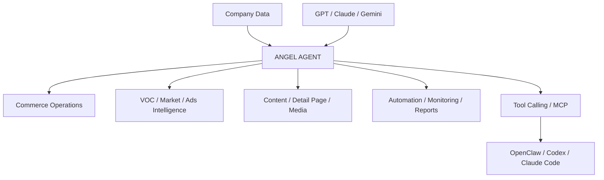

# ANGEL AGENT

Internal E-commerce AI Operating System for product management, VOC intelligence, advertising, content generation, commerce analytics, automation, and AI agent workflows.

## Features

### Product & Commerce
- Product Knowledge Base
- Product CRUD
- Cost / Price / Margin Management
- Sales / Order / Inventory Analytics
- ROAS / CPA / CVR Tracking

### VOC & Market Intelligence
- Review / VOC Analysis
- Pain Point / Desire / Purchase Motivation Extraction
- Competitor Product / Ad Monitoring
- Market Opportunity Analysis
- Supplier / Sourcing Intelligence

### Advertising & Content
- Ad Reference Library
- Hook / Copy / CTA Analysis
- Ad Copy Generation
- Short-form Video Scripts
- Threads / Instagram / Blog Content
- Viral Ad Recreation

### Detail Page
- Detail Page Structure Generation
- Sales Copy Generation
- Image Prompt Generation
- React Template Rendering
- AI-assisted Editing

### Automation & Reporting
- Scheduled Data Collection
- Commerce / Ads / Review Sync
- Competitor / Supplier Monitoring
- Automated Reports
- Anomaly Detection
- File / Document Processing

### AI Agent
- Natural Language Commands
- Tool Calling
- Multi-step Workflow Execution
- Product / VOC / Ads / Sales Analysis
- Content / Script / Detail Page Generation
- MCP / OpenClaw Integration

---

## Architecture

---

## Tech Stack

### Application
- Next.js 16
- React
- TypeScript
- Tailwind CSS

### Backend & Database
- Supabase
- PostgreSQL
- Supabase Auth
- Supabase Storage

### AI
- OpenAI API
- Anthropic Claude API
- Google Gemini API
- Structured Output
- Tool Calling

### Integrations
- Cafe24 API
- Naver Commerce API
- Coupang API
- Meta Marketing API
- Google Ads API
- Threads API

### Automation & Agent
- Cron Jobs
- Webhooks
- MCP
- OpenClaw
- Codex
- Claude Code

### Infrastructure
- Vercel
- Git
- GitHub

---

## Roadmap

See [`docs/ROADMAP.md`](docs/ROADMAP.md).